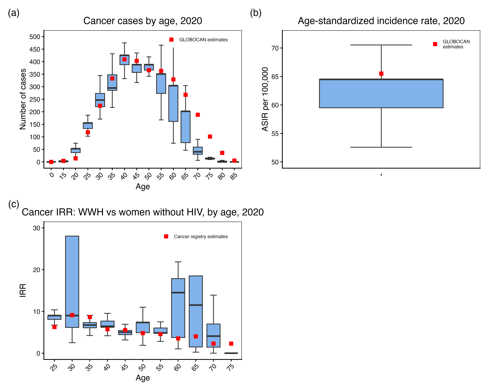
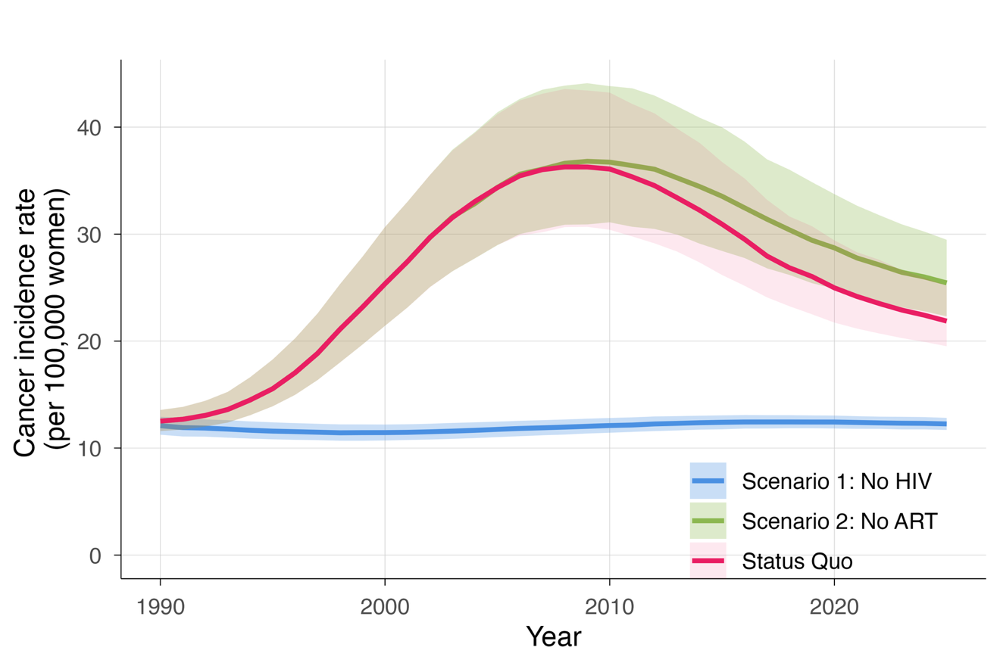
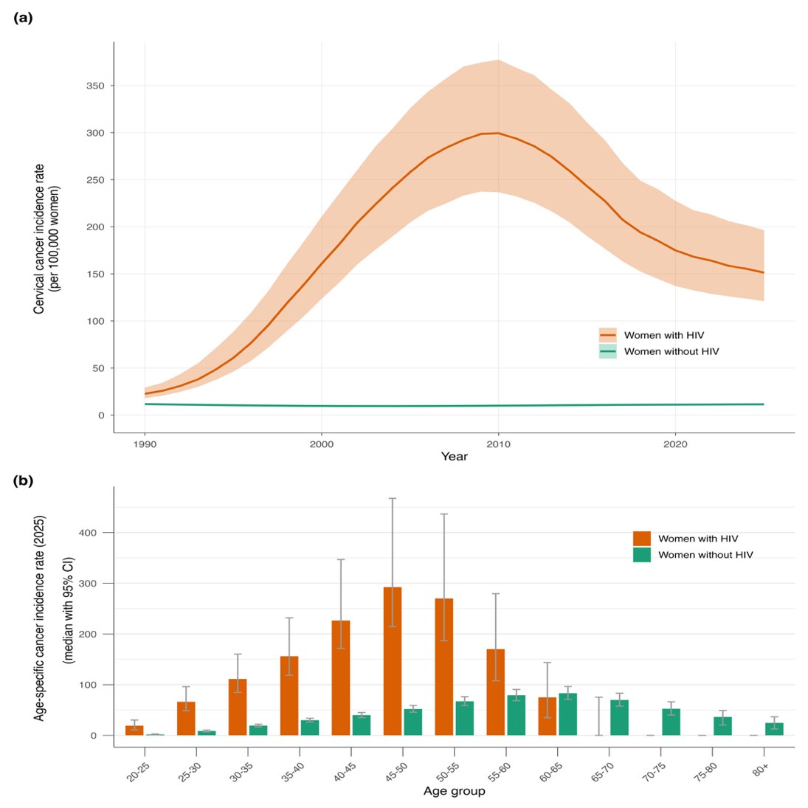

<!-- Generated from "Estimating cervical cancer burden by HIV in Zambia_revised_v2.docx" by docs/docx_to_markdown.py.
     The .docx is the document of record; edit that, then regenerate. -->
**Target journal: **Scientific Reports

**Title: **The impact of HIV and antiretroviral therapy on cervical cancer burden in Zambia: A modelling study.

**Authors**: John Andoh^1^^,2*^, Herbert Kapesa^3^, Susan Citonje Msadabwe^4^, Albert Manasyan^3^^,^^5^, Paul Kamfwa^4^, Watson Zulu^6^, Cliff Kerr^7^, Matthias Egger^8^^,^^9^^,1^^0^, Eliane Rohner^1^^,2^, Robyn Stuart^1^^1^, Cari van Schalkwyk^1^^2^

**Affiliations:**
^1^^ ^Institute of Social and Preventive Medicine, University of Bern, Bern, Switzerland
^2^ Graduate School for Health Sciences, University of Bern, Bern, Switzerland
^3^ Centre for Infectious Disease Research in Zambia, Lusaka, Zambia
^4^ Department of Gynecologic Oncology, Cancer Diseases Hospital, Lusaka, Zambia
^5^ University of Alabama at Birmingham, Birmingham, Alabama, United States of America
^6^^ ^Research Unit, Cancer Diseases Hospital, Lusaka, Zambia
^7^^ ^Global Health Division, Institute for Disease Modeling, Bill and Melinda Gates Foundation, Seattle, Washington, USA
^8^^ ^Department of Infectious Diseases and Hospital Epidemiology, University Hospital Zurich, University of Zurich, Switzerland
^9^^ ^Population Health Sciences, Bristol Medical School, University of Bristol, Bristol, United Kingdom
^1^^0^^ ^Centre for Integrated Data and Epidemiological Research, School of Public Health, University of Cape Town, Cape Town, South Africa
^1^^1^^ ^Gender Equity Division, Bill and Melinda Gates Foundation, Seattle, Washington, USA
^1^^2^^ ^South African Centre for Epidemiological Modeling and Analysis, Stellenbosch University, Stellenbosch, South Africa

**Corresponding Author: **
John Andoh, Institute of Social and Preventive Medicine, University of Bern, Switzerland, john.andoh@unibe.ch

**Keywords: **
Cervical cancer, HPV, mathematical modelling, HIV, Antiretroviral therapy (ART), Zambia
**List of Abbreviations**
ART: Antiretroviral therapy
DHS: Demographic health survey
GLOBOCAN: Global Cancer Observatory
HIV: Human immunodeficiency virus
HPV: Human papillomavirus
HPVsim: Human papillomavirus simulator
IRR: Incidence rate ratios
LMICs: Low- and middle-income countries
UN: United Nations
UNAIDS: United Nations Programme on HIV/AIDS
VIA: Visual Inspection with Acetic acid
WHO: World Health Organization

**Article Metrics: **
Abstract: 200 words (max 200 words)
Word count: 3998 words (max 4500 words)
Figures and tables: 4 (max 8 figures and tables)
References: 45 (max 60 references)

**Abstract**
Cervical cancer is the leading cause of cancer death among women in Zambia, where widespread HIV infection elevates cervical cancer risk. However, HIV’s contribution to Zambia’s cervical cancer burden and the extent to which antiretroviral therapy (ART) has mitigated this burden, remain poorly quantified. We adapted HPVsim, an existing open-source mathematical model simulating human papillomavirus (HPV) and cervical cancer natural history, to capture the dual burden of cervical cancer and HIV in Zambian women. We extended HPVsim by incorporating country-specific HIV incidence data and modeled how HIV alters cervical disease progression through CD4 cell count-dependent modification of HPV susceptibility and disease severity. We calibrated the model to GLOBOCAN cervical cancer estimates and cervical cancer incidence rate ratios by HIV status estimated from the Zambian Cancer Registry. We estimated that by 2025, approximately half of all cervical cancer cases in Zambia could be attributed to HIV co-infection. Although ART prevented at least an estimated 5.4% of cervical cancer cases nationally and 8.7% of cases among women with HIV, HIV remains a major driver of the cervical cancer burden, accounting for 50% of cases. HIV-stratified prevention strategies will be essential for Zambia to achieve the World Health Organization’s cervical cancer elimination targets.
**Introduction**
Cervical cancer is the fourth leading cause of cancer death in women globally [1] and the leading cause of cancer death among women in Zambia [1], where HIV prevalence among women is among the highest in sub-Saharan Africa.  According to the Global Cancer Observatory (GLOBOCAN), Zambia had an estimated age-standardized cervical cancer incidence rate of 72 per 100,000 women and a mortality rate of 50 per 100,000 women in 2022 [2]. These incidence estimates are much higher than the rates observed in high-income countries, and exceed the rates observed in other African countries, including Nigeria (26 per 100,000 women) and South Africa (33 per 100,000 women) [3]. Cervical cancer is preventable through vaccination against oncogenic human papillomavirus (HPV) genotypes [4], screening, and treatment of precancerous lesions [5]. Cervical cancer prevention policies in high-income countries have led to substantial reductions in incidence and mortality [6]. However, similar progress has not been achieved in low- and middle-income countries (LMICs), where prevention programs are often underdeveloped or strained due to limited resources and a high disease burden [7].
Despite a global commitment to eliminate cervical cancer, progress in Zambia has been limited. Zambia launched a national cervical cancer screening program in 2006 [8] and, in 2023, updated its guidelines to adopt HPV DNA testing as the primary screening method [9], replacing the less accurate Visual Inspection with Acetic acid (VIA) [10]; however, screening coverage remains below 30% [11–13]. Zambia also introduced HPV vaccination in 2019 through a school-based program for girls aged 9-14 years [14], but uptake has remained low, with published estimates of vaccination coverage ranging from approximately 39% to 78% [15], reflecting ongoing programmatic challenges including limited access and awareness.
Beyond limited screening and vaccination coverage, Zambia’s high HIV prevalence further contributes to its cervical cancer burden. HIV prevalence among adult women was estimated at 12% in 2024 [16]. Women with HIV are more likely to acquire HPV, to experience persistent infection, and to experience progression to cervical cancer than women without HIV [17,18], although antiretroviral therapy (ART) partially reduces this excess risk, with women on ART having a lower prevalence of oncogenic HPV infection, slower progression of cervical lesions, and reduced cervical cancer incidence compared to those not receiving ART [19]. In response, Zambia has integrated cervical cancer screening into HIV services [20], and ART coverage expanded rapidly following scale-up in the early 2000s, reaching over 80% by 2020 [21].  Cervical cancer incidence estimates among women with HIV in the region remain limited. Clinic-based studies reported substantially elevated incidence rates, including 447 per 100,000 person-years in an urban South African cohort [22] and 123 per 100,000 person-years among women receiving ART in Harare, Zimbabwe [23]. A study using health insurance data from South Africa reported a threefold higher cervical cancer incidence rate among women with HIV than women without HIV [24]. However, these estimates should be interpreted cautiously because of differences in study populations, observation periods, and definitions of time at risk.
Uncertainty remains about how to best allocate limited resources to reduce cervical cancer burden in settings with high HIV prevalence. Few studies have quantified the combined impact of cervical cancer and HIV to guide evidence-based prevention efforts in Zambia [25,26]. Mathematical models offer a powerful framework for assessing these population-level effects, particularly when models capture country-specific demography, sexual network patterns, HPV transmission and cervical disease natural history, as well as HIV-related immunosuppression and its modification by ART.
In this study, we adapted the human papillomavirus simulator (HPVsim) [27] – an individual-based model of HPV transmission and cervical cancer – to capture the dual burden of cervical cancer and HIV in Zambia. Specifically, we estimated HIV-attributable cervical cancer cases and quantified the impact of ART introduction and scale-up on cervical cancer incidence.

**Methods**
We adapted HPVsim, a model of HPV transmission and cervical cancer, to the Zambian context and extended it to capture HIV infection and ART. The model was calibrated to national cervical cancer incidence estimates and incidence rate ratios by HIV status. Using counterfactual scenarios with no HIV and no ART, we estimated HIV-attributable cervical cancer burden and the population-level impact of ART scale-up.

*HPV natural history modelling with HPVsim*
Described in detail elsewhere [27], HPVsim is an agent-based model that incorporates country-specific dynamics such as structured sexual networks, genotype-specific HPV transmission, and demographic profiles to simulate the natural history of cervical cancer. Simulations begin by generating agents (people) that reflect Zambia’s demographic profile, using data from UN World Population Prospects, with age structure, sex distribution, and mortality, initialized in 1960 (the baseline year), and updated at yearly time steps.^ ^HPV transmission, is modelled through two sexual contact layers (casual or married), allowing multiple partnerships. HPVsim models the continuous natural history of HPV infection, from viral acquisition and episomal growth through cervical dysplasia and invasive cancer. Following infection, individuals are assigned to one of three disease trajectories: clearance without dysplasia, progression to dysplasia with subsequent clearance, or progression to cervical cancer, with event timings that can be modified by interventions or changes in immune status due to HIV. Initial HPV genotype distributions, HPV prevalence, and other model parameters were drawn from calibrations of a multi-country HPVsim study that included Zambia (Supplementary Table S1) [28]. The model allows HIV coinfection and associated immunosuppression as parametrized inputs.
HPVsim includes an HIV model that represents HIV dynamics using age- and sex-stratified HIV incidence and mortality inputs, rather than explicitly modelling HIV transmission between individuals. At each time step, individuals may acquire HIV or die from HIV-related causes based on age, sex and calendar year, using incidence and mortality rates from the UNAIDS Spectrum tool [29,30]. HIV disease progression is modelled through CD4 decline and CD4 reconstitution after ART initiation drawing on the EMOD-HIV model framework [31,32]. CD4 cell count dynamics are represented using a time-dependent Weibull distribution based on the fraction of remaining HIV prognosis time, with an immediate post-infection drop to 594 cells/μL (representing acute phase depletion and partial rebound) followed by a decline to 59 cells/μL at death according to
CD4(cells/μL) = (24.363 - 16.672f)^2^
where f is the fraction of remaining time of HIV prognosis. Once an individual initiates ART, CD4 reconstitution follows a quadratic increase that saturates over three years:
CD4 count increase = 15.584 × (months since initiation) - 0.2113 × (months since initiation)²
If ART is discontinued, CD4 decline resumes; upon resuming ART, immune reconstitution depends on the updated CD4 count and the individual's age at re-initiation.
HIV infection alters the natural history of HPV infection and cervical cancer development through immunologic mechanisms. The model captures this effect using CD4 cell count-dependent risk stratification, categorizing women with HIV into two states: CD4 <200 cells/μL (severe immunosuppression) and CD4 ≥200 cells/μL (moderate immunosuppression). Women with HIV are assigned increased HPV susceptibility and disease severity parameters that vary by CD4 stratum and are calibrated as shown in Table 1. Greater susceptibility translates to higher HPV acquisition rates, while increased severity accelerates disease progression from HPV infection to precancerous lesions and invasive cancer.
*Calibration*
We calibrated the model to fit to Zambia’s **age-standardized cervical cancer incidence rate **and age-specific cervical cancer cases in 2020, as estimated by **GLOBOCAN [1,2].**To better capture HIV-related differences in risk, we additionally included age-specific cervical cancer incidence rate ratios (IRRs) by HIV status, derived from the Zambian Cancer Registry, as calibration targets. The Zambian Cancer Registry captures only diagnosed cases, and registry coverage and reporting may be incomplete. Therefore, the absolute number of cancer cases by HIV status in the registry is not suitable for calibration in *HPVsim*, which estimates all incident cancers. Using IRRs helps reduce potential detection bias associated with recorded diagnosed cases. We calculated age-specific IRRs by aggregating cancer cases and population denominators by year, five-year age groups, and HIV status from 2019 to 2022. Population denominators were obtained from UNAIDS HIV population estimates and UN World Population Prospects 2020. Incidence rates were calculated for women with and without HIV within each age group, and IRRs were computed as their ratio. Missing HIV status values were imputed through proportional allocation using provincial HIV prevalence estimates from UNAIDS. We conducted sensitivity analyses examining IRRs that excluded cases with missing HIV status or classified all unknown cases as HIV negative.
For our model calibration, we varied parameters on HPV transmission probability, immunity, sexual mixing, as well as HIV related parameters including relative HPV susceptibility and disease severity (Table 1). We used **HPVsim’s** default calibration tool which employs **Optuna** hyperparameter optimization [33] to explore the parameter space and identify parameter sets that minimize the overall mismatch between model outputs and calibration targets, measured as the sum of absolute normalized differences.

*I**mpact of HIV and ART*
Our Status Quo model used for calibration assumes no preventive measures and interventions for cervical cancer such as HPV vaccination, screening or treatment of precancerous lesions. Using the best fitting calibrated parameters, we simulated our Status Quo scenario, as well as two scenarios to assess the impact of HIV and ART. In a counterfactual scenario without HIV (Scenario 1), HIV was never introduced into the simulated population (i.e. zero HIV incidence, prevalence, and mortality), thereby removing the impact of HIV-associated increased HPV susceptibility and relative disease severity. In a separate counterfactual scenario without ART (Scenario 2), we set ART coverage to zero to estimate the population-level impact of ART scale-up. In Scenario 1 (No HIV), we removed all HIV-related inputs from the model, including HIV incidence, HIV-related mortality, CD4 dynamics, and ART. In Scenario 2 (No ART), ART coverage was set to zero while HIV prevalence, incidence, and all other HIV parameters were retained at status quo levels, isolating the protective effect of ART on cervical cancer incidence.

*Ethical **considerations*
Individual patient consent was not obtained for this analysis, as the study used de-identified, routinely collected data. The study was approved by the University of Zambia Biomedical Research Ethics Committee (Ref #3847-2023), the National Health Research Authority (Ref # NHRA0004/11/05/2023), and the Cantonal ethics committee in Bern (PB_2016-00273), Switzerland, which granted a waiver of informed consent in accordance with local regulations and ethical guidelines. Additionally, a letter was provided by the Ministry of Health of the Republic of Zambia authorizing the Cancer Diseases Hospital to share its data.

**Results**
*Model Calibration*
We conducted 5,000 calibration trials to identify parameter combinations that minimized the mismatch between model outputs and calibration targets. Parameters related to HPV transmission probability, immunity, sexual mixing patterns, and HIV-related factors including relative susceptibility and relative disease severity were jointly optimized. The resulting parameter combinations showed good agreement with the calibration targets, including the age-specific number of cancer cases and age-standardized incidence rate for 2020 from GLOBOCAN, and the age-specific cancer IRRs by HIV status from Zambia’s cancer registry for women aged 25 to 80 years. Parameter ranges used in calibration are shown in Table 1, informed by current evidence on HPV and HIV coinfection dynamics. Figure 1 compares model outputs with calibration targets from the best 200 parameter combinations and Figure S1 shows the distributions of the 200 best fitting parameter combinations.

*Sensitivity analysis in deriving incidence rate ratio calibration targets*
In the sensitivity analysis for estimating IRRs from the cancer registry (Table S2), we compared three approaches to handling missing HIV status (45% of all reported cases). The primary analysis used province-based proportional allocation, distributing unknown HIV cases according to the observed HIV-positive proportion within each province before calculating rates. Two sensitivity conditions were examined: excluding all cases with unknown HIV status and conservatively classifying all unknown cases as HIV negative. IRR estimates from the proportional allocation approach were nearly identical to those from the exclusion approach across all age groups, both of which were broadly consistent with established literature reporting approximately six-fold higher cervical cancer incidence in women with HIV than women without HIV [18]. The conservative scenario that classified all unknowns as HIV negative was included to demonstrate the sensitivity of IRR estimates to extreme missing data assumptions but produced implausibly low IRR estimates. To maximize data utilization while maintaining estimate validity, we selected the proportional allocation approach for our primary analysis.

*Counterfactual scenarios*
We ran 10,000 simulations, consisting of 100 simulations for each of the 100 best fitting parameters, and estimated the median number of cancer cases with interquartile ranges for each year and scenario from 1960 to 2025 for each scenario. Figure 2 shows the cervical cancer incidence rates under all three scenarios. The model indicates that the impact of the HIV epidemic on cervical cancer incidence emerged in the early 1990s, with progressively widening divergence between scenarios due to steeply increasing HIV-related cervical cancer incidence over the following decade. By 2025, the model estimates 71,042 cumulative cervical cancer cases under the Status Quo scenario compared with 35,580 cases in the counterfactual scenario without HIV (Scenario 1), corresponding to an attributable fraction of 49.9%. The HIV related burden peaked in 2012, when about 65% of cervical cancer cases were attributable to HIV. The protective effect of ART is evident in the counterfactual scenario with zero ART coverage (Scenario 2); although the ART rollout began in the early 2000s, its effect on cancer incidence became apparent only by the 2010s. By 2025, ART is estimated to have averted at least 4,068 cumulative cervical cancer cases overall (a 5.4% reduction) and at least 3,932 cases among women with HIV (an 8.7% reduction) compared with the no ART scenario.

*Cervical cancer incidence by **HIV **status and age*
Figure 3a, compares crude cervical cancer incidence rates over time in women with and without HIV. Across the study period, incidence rates were substantially higher among women with HIV, peaking in 2010, at levels about 30 times higher than those among women without HIV. Age-specific incidence rates were also consistently higher among women with HIV (Figure 3b). For example, among women aged 45–50-years, cervical cancer incidence reached 293 per 100,000 women with HIV, nearly six times higher than in women without HIV. Although the relative rate associated with HIV was highest among women aged 20-25 years (approximately 8-fold), the absolute incidence in this age group was much lower than in other age groups. Women with HIV experienced peak cervical cancer incidence rates approximately 10 years earlier, at ages 45-50 years, compared with 60-65 years among women without HIV.

**Discussion**
In Zambia, HIV accounted for nearly half of all cervical cancer cases between 1990 and 2025, with the HIV-attributable fraction peaking at approximately 65% in 2012. These findings are consistent with regional estimates showing that in Southern Africa, an estimated 43.5% of cervical cancer cases are attributable to HIV [34]. Although the introduction and scale-up of ART from the year 2000 onwards prevented more than 5% of all cervical cancer cases and nearly 9% of cases among women with HIV by 2025, cervical cancer incidence remains substantially higher among women with HIV across most age groups. These findings indicate that while ART reduces the risk of developing cervical cancer, it has not eliminated the excess cervical cancer burden among women with HIV. Age-specific incidence rates among women with HIV peaked almost 10 years earlier than among women without HIV, a pattern consistent with a global analysis showing that most HIV-attributable cervical cancers in Southern Africa occurred among women younger than 45 years [34].
Our model estimates are consistent with the available evidence on the impact of HIV on cervical cancer risk and the protective effect of ART [17–19]. Meta-analyses have shown that women with HIV are at increased risk of acquiring HPV, developing precancerous lesions, and progressing to cervical cancer, with risk inversely associated with CD4 cell count . Evidence also indicates that women on ART are at lower risks of HPV acquisition, precancer, and progression to invasive cervical cancer [19]. We incorporated these established mechanisms into HPVsim by modelling CD4-dependent immunodeficiency and ART-related immune reconstitution using Zambia-specific ART coverage data. Although the ART rollout began in the early 2000s, its protective effect on cervical cancer incidence became apparent only by the 2010s, a delay consistent with the long natural history of HPV-to-cancer progression (typically 10 to 30 years), the time required for CD4 immune reconstitution to slow or reverse cervical lesion progression following ART initiation, and the gradual scale-up of ART coverage during that period. Our findings are also consistent with results from a global analysis showing that most HIV-attributable cervical cancers in Southern Africa occurred among women younger than 45 years [34]. Our findings are consistent with the WHO’s and Zambia’s Ministry of Health’s screening guidelines, which recommend earlier and more frequent cervical cancer screening for women with HIV [9,35]. Incidence rates in women without HIV have remained steady over the years. An effective cervical cancer program could enable Zambia to meet the WHO cervical cancer elimination target for this group [36].
The adaptation of an existing open-source model to simulate cervical cancer and HIV outcomes for Zambia, a country with a high burden of HIV and HPV infection, is an important strength of this study. Leveraging HPVsim's versatility, we developed a dynamic model and carefully calibrated it to Zambian data. Our findings align with both GLOBOCAN estimates of cervical cancer burden and age-specific incidence rates, as well as the data from the Zambian cancer registry. HPVsim was previously calibrated to Zambia as part of a multi-country calibration effort, but the model fit was poor, in part because HIV was unaccounted for [28]. We demonstrated that HPVsim can be extended to model HIV co-infection and incorporate available data from resource-limited settings to provide estimates of HIV and ART’s influence on cervical cancer burden. By explicitly incorporating HIV co-infection and CD4-dependent disease progression, we achieved improved model fits. We made all code and scripts available so that other researchers can use these resources to build models of HPV and cervical cancer natural history in settings affected by the HIV epidemic. HPVsim ultimately serves as a tool for addressing urgent health policy questions, including the long-term impact of ART on cervical cancer burden and the potential of interventions such as screening and vaccination to reduce disease incidence. In this study, we investigated the role of the HIV epidemic and ART in shaping cervical cancer burden in Zambia to date. The modest overall impact of ART on cervical cancer incidence reflects several interacting mechanisms. First, the long latency between HPV infection and invasive cancer (typically 10 to 30 years) means that women who acquired HPV and developed early cervical dysplasia before ART became available may continue to progress to invasive cancer even after ART initiation [37], particularly in the absence of an effective screening program [38]. Second, and critically, ART extends the survival of women with HIV who might otherwise have died from AIDS-related causes before developing cervical cancer [39]. This survivorship effect may partially offset the protective biological impact of ART at the population level, contributing to the modest net reduction in cervical cancer incidence we estimate. We hypothesise that ART's impact on cervical cancer incidence may be greater for women currently entering ART programs under a universal test-and-treat policy, as earlier initiation with preserved immune function and highly effective dolutegravir-based regimens should reduce both the depth and duration of immunosuppression. This remains a hypothesis rather than a model projection, as our simulations end at 2025, and it may be tempered by rising ART drug resistance globally [40,41]. This study focused on the intersection of HIV and cervical cancer and did not model HPV vaccination or screening interventions. Vaccination was excluded because coverage remained negligible during the modelled period. Although we do not model screening or vaccination interventions here, focusing instead on the intersection of HIV and cervical cancer, HPVsim has demonstrated its utility in other settings. For example, modelling in Tunisia identified that integrating routine HPV vaccination for girls aged 11-12 years with Pap smear screening was the most cost-effective prevention strategy [42]. Building on these insights, we are undertaking similar cost-effectiveness analysis to identify optimal strategies tailored to women with HIV and the broader population in Zambia.
Limitations of this study relate to data quality in model parametrisation and calibration. The Zambian cancer registry captures clinically diagnosed cases from all regions but is affected by reporting backlogs, and HIV status remains incomplete for many women with cervical cancer. To address this, we incorporated age-specific cervical cancer incidence rate ratios by HIV status from the registry as calibration targets and conducted sensitivity analyses to assess robustness despite incomplete HIV assignment. This approach assumes that incidence rate ratios among diagnosed cases with known HIV status approximate those among all incident cases, which may not hold if cervical cancer detection and HIV status ascertainment differ by HIV status. For example, women with HIV may have more regular healthcare contact, increasing the likelihood of a cancer diagnosis and potentially inflating registry-derived IRRs. Nevertheless, the IRRs we used for calibration were largely consistent with existing literature [18,24] and based on the most comprehensive data source available for Zambia. Further, although GLOBOCAN provides country-specific incidence estimates, its methodology for many African countries, including Zambia, is based on projections from older and regional data extrapolated to current years [43]. While these estimates represent the best available data for national burden assessment, they may not reflect the true magnitude or age distribution of cervical cancer incidence in Zambia, potentially affecting calibration accuracy.
Another limitation concerns the model’s representation of population-level sexual behaviour. HPVsim may not fully capture heterogeneity when sexual behaviour is structured into distinct subpopulations rather than distributed continuously across individuals. This limitation is suggested by the unusually flat age distribution of cervical cancer incidence observed in Zambia, with similar rates among women aged 35–40 and 60–65 years. This pattern may reflect the superposition of multiple behavioural subpopulations with different ages of sexual debut and partnership patterns, producing overlapping age distributions of cancer incidence. By implicitly assuming more homogeneous behavioural patterns, the model may underestimate or misrepresent the breadth of ages at which cervical cancer occurs. Future model extensions could address this by explicitly incorporating behavioural subgroups or allowing greater flexibility in representing population heterogeneity. A further limitation is that our model does not explicitly capture changes in ART guidelines and effectiveness over the study period. The progressive shift from CD4-threshold-based to universal test-and-treat initiation criteria, and the improvement in regimen virological efficacy from early single and dual therapy to modern dolutegravir-based regimens [44], are not distinguished in the model. Another limitation is how HIV incidence is represented in HPVsim. HIV acquisition is modelled using age and sex specific incidence estimates rather than an explicit HIV transmission model. Because these inputs already reflect the observed, ART influenced HIV epidemic in Zambia, they remain fixed across all scenarios. Consequently, the no ART scenario captures only the direct clinical effects of ART on women with HIV, including survival, CD4 recovery, and HIV associated HPV risk, but not ART's effect on reducing HIV transmission. As a result, our estimate of ART's impact on cervical cancer burden is likely conservative. A true no ART counterfactual would require either an explicit HIV transmission model, or counterfactual HIV incidence estimates in the absence of ART, which were not available for Zambia.
In conclusion, HIV has been a dominant driver of cervical cancer in Zambia, accounting for approximately half of all cases between 1990 and 2025, despite women with HIV representing only about 15% of the adult female population. Although ART prevented more than 5% of cervical cancer cases nationally, cervical cancer incidence remains unacceptably high, particularly among women with HIV, indicating that ART alone is insufficient to substantially reduce population-level burden. These findings are consistent with current WHO and Zambian Ministry of Health guidelines, which recommend that women with HIV initiate screening earlier at 25 years of age, with regular screening of 3 to 5 years following a negative result on the high-performance HPV DNA test [9,45]. In contrast, cervical cancer incidence among women without HIV has remained relatively stable, suggesting that effective population-level prevention could enable Zambia to achieve the WHO cervical cancer elimination target for this group [36]. Future research should build on these model-based estimates to identify the most cost-effective cervical cancer prevention strategies, including optimal screening approaches for women with HIV and the long-term impact of HPV vaccination. Such work is now underway in Zambia and will be critical to informing HIV-stratified elimination strategies. HIV-stratified prevention strategies will be essential for Zambia to achieve the World Health Organization’s cervical cancer elimination targets.
**Acknowledgements**
This study was supported by the Swiss Cancer Research Foundation (grant number KFS-S 447-08-2021) and by the US National Institutes of Health’s National Institute of Allergy and Infectious Diseases; the Eunice Kennedy Shriver National Institute of Child Health and Human Development; the National Cancer Institute; the National Institute of Mental Health; the National Institute on Drug Abuse; the National Heart, Lung and Blood Institute; the National Institute on Alcohol Abuse and Alcoholism; the National Institute of Diabetes and Digestive and Kidney Diseases; the Fogarty International Center with grant number U01AI069924.
Simulations and calibrations were performed on UBELIX (https://www.id.unibe.ch/hpc), the HPC cluster at the University of Bern

**Author contributions**
JA, ER, and CvS conceptualized the study; ME, AM and ER were involved in funding acquisition; HK, SCM, PK and WZ were involved in data acquisition and management; JA, ER, CvS, and RS prepared the first draft of the manuscript; CK, JA and RS setup the calibration, JA performed the simulations and ran the analyses. All authors contributed to the interpretation of the results and reviewed the manuscript.

**Competing Interests**
The authors declare no conflicts of interest.

**Data availability**
Data on cervical cancer cases and incidence for Zambia were derived from GLOBOCAN 2022, produced by the International Agency for Research on Cancer (IARC). These data are publicly available at , subject to IARC terms of use. Individual-level data from the Zambian Cancer Registry are not publicly available due to legal and ethical restrictions. Access to these data may be requested directly from the Zambian Cancer Registry subject to approval and applicable data use agreements.
The code and scripts used in this study are available at github.com/AndohJ0/HPVSim_Zambia.

**References**
1.Sung, H. *et al.* Global Cancer Statistics 2020: GLOBOCAN Estimates of Incidence and Mortality Worldwide for 36 Cancers in 185 Countries. *CA: A Cancer Journal for Clinicians* **71**, 209–249 (2021).
2.Ferlay, J. *et al.* Global Cancer Observatory: Cancer Today (version 1.1). *International Agency for Research on Cancer, Lyon, France* https://gco.iarc.fr/today/en (2024).
3.Cervical cancer statistics | World Cancer Research Fund.
4.Joura, E. A. *et al.* A 9-valent HPV vaccine against infection and intraepithelial neoplasia in women. *The New England journal of medicine* **372**, 711–723 (2015).
5.Cohen, P. A., Jhingran, A., Oaknin, A. & Denny, L. Cervical cancer. *The Lancet* **393**, 169–182 (2019).
6.Simms, K. T. *et al.* Impact of scaled up human papillomavirus vaccination and cervical screening and the potential for global elimination of cervical cancer in 181 countries, 2020-99: a modelling study. *The Lancet. Oncology* **20**, 394–407 (2019).
7.Wu, E. S., Jeronimo, J. & Feldman, S. Barriers and challenges to treatment alternatives for early-stage cervical cancer in lower-resource settings. *Journal of Global Oncology* **3**, 572–582 (2017).
8.Mwanahamuntu, M. H. *et al.* Advancing Cervical Cancer Prevention Initiatives in Resource-Constrained Settings: Insights from the Cervical Cancer Prevention Program in Zambia. *PLoS Med* **8**, e1001032 (2011).
9.Health-Zambia, M. of. *Zambian National Guidelines for Cervical Cancer Screening*. 0–55 (2023).
10.Smith, S. K. *et al.* Performance of screening tools for cervical neoplasia among women in low- and middle-income countries: A systematic review and meta-analysis. *PLOS Global Public Health* **3**, e0001598 (2023).
11.Alpar, A. D., Ndiaye, C., Guillaume, D., Limaye, R. J. & Rosen, J. G. High unmet needs for cervical cancer screening among women living with HIV in six African countries: A population-based study. *Int J STD AIDS* **36**, 397–405 (2025).
12.Fallah, P. N., Citonje-Msadabwe, S., Fundafunda, S., Schmeler, K. M. & Kamfwa, P. Scale-up of cervical cancer prevention services in Zambia. *International Journal of Gynecological Cancer* **35**, 101816 (2025).
13.Lubeya, M. K. *et al.* Self-Reported Cervical Cancer Screening Uptake Among Women of Reproductive Age in Zambia: Evidence from the 2021 Zambia Population-Based HIV Impact Assessment (ZAMPHIA) Survey. *Cancer Control* **31**, 10732748241307361 (2024).
14.Organisation, W. H. *Costing the National Strategic Plan on Prevention and Control of Cervical Cancer: Zambia, 2019–2023*. (World Health Organization, 2020).
15.Lubeya, M. K. *et al.* Correlates of Parental Consent to Human Papillomavirus Vaccine Uptake by Their Adolescent Daughters in ZAMBIA: Application of the Health Belief Model. *Vaccines (Basel)* **11**, 912 (2023).
16.{UNAIDS Global data on HIV} & response. AIDSinfo - UNAIDS. (2024).
17.Liu, G., Sharma, M., Tan, N. & Barnabas, R. V. HIV-positive women have higher risk of human papilloma virus infection, precancerous lesions, and cervical cancer. *AIDS* **32**, 795–808 (2018).
18.Stelzle, D. *et al.* Estimates of the global burden of cervical cancer associated with HIV. *The Lancet Global Health* **9**, e161–e169 (2021).
19.Kelly, H. *et al.* Association of antiretroviral therapy with high-risk human papillomavirus, cervical intraepithelial neoplasia, and invasive cervical cancer in women living with HIV: a systematic review and meta-analysis. *Lancet HIV* **5**, e45–e58 (2018).
20.Asangbeh-Kerman, S. L. *et al.* Cervical cancer prevention and care in HIV clinics across sub-Saharan Africa: results of a facility-based survey. *J Int AIDS Soc* **27**, e26303 (2024).
21.Babatunde, A. O., Akin-Ajani, O. D., Abdullateef, R. O., Togunwa, T. O. & Isah, H. O. Review of antiretroviral therapy coverage in 10 highest burden HIV countries in Africa: 2015–2020. *Journal of Medical Virology* **95**, e28320 (2023).
22.Rohner, E. *et al.* Cervical cancer risk in women living with HIV across four continents: A multicohort study. *International Journal of Cancer* **146**, 601–609 (2020).
23.Cancer incidence among people living with HIV in Zimbabwe: A record linkage study - Shamu - 2022 - Cancer Reports - Wiley Online Library. https://onlinelibrary.wiley.com/doi/10.1002/cnr2.1597.
24.Villalobos, N. V. F. *et al.* Cervical precancer and cancer incidence among insured women with and without HIV in South Africa. *International journal of cancer* **154**, 273–283 (2024).
25.Bateman, A. C. *et al.* The burden of cervical pre-cancer and cancer in HIV positive women in Zambia: a modeling study. *BMC Cancer* **15**, 541 (2015).
26.Parham, G. P. *et al.* Population-Level Scale-Up of Cervical Cancer Prevention Services in a Low-Resource Setting: Development, Implementation, and Evaluation of the Cervical Cancer Prevention Program in Zambia. https://doi.org/10.1371/journal.pone.0122169 (2015) doi:10.1371/journal.pone.0122169.
27.Stuart, R. M. *et al.* HPVsim: An agent-based model of HPV transmission and cervical disease. *PLOS Computational Biology* **20**, e1012181 (2024).
28.Stuart, R. M. *et al.* Inferring the natural history of HPV from global cancer registries: insights from a multi-country calibration. *Sci Rep* **14**, 15875 (2024).
29.Stover, J., Glaubius, R., Kassanjee, R. & Dugdale, C. M. Updates to the Spectrum/AIM model for the UNAIDS 2020 HIV estimates. *Journal of the International AIDS Society* **24**, 25778 (2021).
30.Spectrum-Avenir Health.
31.Bershteyn, A. *et al.* Implementation and applications of EMOD, an individual-based multi-disease modeling platform. *Pathogens and Disease* **76**, fty059 (2018).
32.Bershteyn, A. *et al.* Description of the EMOD-HIV Model v0.7. https://arxiv.org/abs/1206.3720v1 (2012).
33.Akiba, T., Sano, S., Yanase, T., Ohta, T. & Koyama, M. Optuna: A Next-generation Hyperparameter Optimization Framework. *Proceedings of the ACM SIGKDD International Conference on Knowledge Discovery and Data Mining* 2623–2631 (2019) doi:10.1145/3292500.3330701.
34.Khalil, A. I. *et al.* Age-specific burden of cervical cancer associated with HIV: A global analysis with a focus on sub-Saharan Africa. *International Journal of Cancer* **150**, 761–772 (2022).
35.*WHO Guideline for Screening and Treatment of Cervical Pre-Cancer Lesions for Cervical Cancer Prevention, Second Edition*. *WHO guideline for screening and treatment of cervical pre-cancer lesions for cervical cancer prevention* (World Health Organization, 2021).
36.Brisson, M. *et al.* Impact of HPV vaccination and cervical screening on cervical cancer elimination: a comparative modelling analysis in 78 low-income and lower-middle-income countries. *The Lancet* **395**, 575–590 (2020).
37.Gilham, C., Sargent, A., Crosbie, E. J. & Peto, J. Long-term risks of invasive cervical cancer following HPV infection: follow-up of two screening cohorts in Manchester. *Br J Cancer* **128**, 1933–1940 (2023).
38.Rohner, E. *et al.* Cervical cancer risk and impact of Pap-based screening in HIV-positive women on antiretroviral therapy in Johannesburg, South Africa. *International Journal of Cancer* **141**, 488–496 (2017).
39.Castle, P. E., Einstein, M. H. & Sahasrabuddhe, V. V. Cervical cancer prevention and control in women living with human immunodeficiency virus. *CA: A Cancer Journal for Clinicians* **71**, 505–526 (2021).
40.Hamers, R. L. *et al.* HIV-1 drug resistance in antiretroviral-naive individuals in sub-Saharan Africa after rollout of antiretroviral therapy: a multicentre observational study. *The Lancet. Infectious diseases* **11**, 750–759 (2011).
41.Waal, R. de *et al.* HIV drug resistance in sub-Saharan Africa: public health questions and the potential role of real-world data and mathematical modelling. *Journal of virus eradication* **4**, 55–58 (2018).
42.Lahdhiri, A. *et al.* HPV DNA screening and vaccination strategies in Tunisia. *Sci Rep* **15**, 27916 (2025).
43.Filho, A. M. *et al.* The GLOBOCAN 2022 cancer estimates: Data sources, methods, and a snapshot of the cancer burden worldwide. *International Journal of Cancer* **156**, 1336–1346 (2025).
44.*Consolidated Guidelines on the Use of Antiretroviral Drugs for Treating and Preventing HIV Infection: Recommendations for a Public Health Approach*. (World Health Organization, Geneva, 2016).
45.WHO. *Global Strategy to Accelerate the Elimination of Cervical Cancer as a Public Health Problem*. (2020).

**Table 1. **HPVsim model parameter prior ranges and calibrated estimates for Zambia. Calibrated values are the median (95% uncertainty interval [95% UI]) across the 200 best-fitting parameter sets identified by Bayesian optimization.
| **Calibrated p****arameter****s** | **Calibration Range** | **Median (****95% UI****)*** |
|---|---|---|
| HPV Transmission probability | (0.1, 0.5) | 0.3 (0.25, 0.35) |
| Immunity against other hrHPV | (0.25, 1) | 0.7 (0.65, 0.85) |
| Age threshold for CIN severity risk increase (years) | (30, 45) | 39 (35, 43) |
| CIN severity risk increase at age threshold (as a multiplier) | (1, 4) | 2.5 (2.4, 3.9) |
| Proportion of males involved in overlapping sexual partnerships (marital and casual) | (0.1, 0.7) | 0.35 (0.2, 0.55) |
| Proportion of males with preference for more than one partner | (0.1, 0.6) | 0.3 (0.3, 0.55) |
| Proportion of females involved in overlapping sexual partnerships (marital and casual) | (0.05, 0.7) | 0.05 (0.05, 0.05) |
| Proportion of females with preference for more than one partner | (0.1, 0.6) | 0.1 (0.1, 0.2) |
| Relative susceptibility to HPV (CD4 <200 cells/μL) | (2.5, 5) | 3.5 (3, 4.75) |
| Relative susceptibility to HPV (CD4 >200 cells/μL) | (1.25, 2.5) | 2.5 (1.5, 2.5) |
| Relative severity of HPV (CD4 <200 cells/μL) | (2.5, 5) | 2.5 (2.5, 3.5) |
| Relative severity of HPV (CD4 >200 cells/μL) | (1.25, 2.5) | 1.75 (1.5, 1.75) |
*HPV* *–* *human papillomavirus, hrHPV – high-risk HPV, CIN – cervical intraepithelial neoplasia *
**Figure 1:** Calibration of HPVsim to cervical cancer burden in Zambia, 2020. (a) GLOBOCAN cervical cancer case estimates by five-year age group.  (b) age-standardized incidence rate (ASIR per 100,000 women). Incidence rate ratio (IRR) for cervical cancer among women with HIV versus women without HIV by age group. For each panel, boxes span the interquartile range and whiskers extend to the most extreme simulated value across 200 best-fitting parameters. Red squares indicate calibration targets.

**Figure 2:** Median model-estimated cervical cancer incidence rates per 100,000 women across three scenarios, with shaded interquartile range bands.

**Figure 3: **Cervical cancer incidence among women with and without HIV from 1990 to 2025 under status quo (a) and 2025 age-specific cervical cancer incidence rates for women with and without HIV under status quo (b). Lines (a), bars (b) show median model estimates, and intervals or bands represent the interquartile ranges

