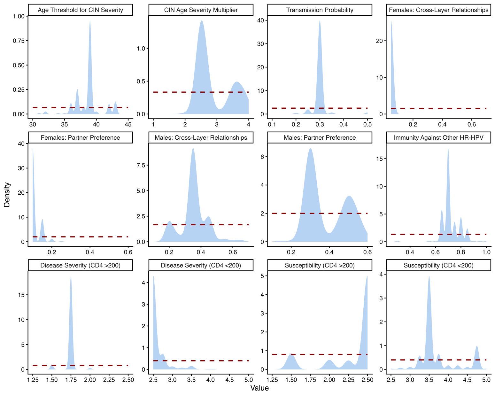

<!-- Generated from "Supplementary material_estimating cervical_Sci_Rep_revision.docx" by docs/docx_to_markdown.py.
     The .docx is the document of record; edit that, then regenerate. -->
**Supplementary material. The impact of HIV and antiretroviral therapy on cervical cancer burden in Zambia: A modelling study.**

**Table S1: **HPVsim model parameters and values
| **Parameter** | **Description** | **Value** | **Source** |
|---|---|---|---|
| location | Geographical setting to determine demographic inputs | zambia | Author judgement |
| n_agents | Number of agents | 10,000 | Author judgement |
| dt | Simulation timestep (not for demographics) | 0.25 years | HPVsim default |
| dt_demog | Simulation timestep for demographics | 1 year | HPVsim default |
| start | Start year of simulation | 1960 | Author judgement |
| end | End year of simulation | 2025 | Author judgement |
| genotypes | HPV genotypes to include in simulation | HPV16, HPV18, five high-risk subtypes (hi5), other high-risk subtypes (ohr) | Author judgement |
| debut | Age of sexual debut, location specific distribution | Females: lognormal (mean:16.69, sd:1.78), Males: lognormal (mean:18.65, sd:3.06) | Estimated from Zambia 2018 Demographic and Health Survey (DHS) [1] |
| beta | Transmission probability of HPV infection | 0.3 (IQR: 0.25, 0.35) | Calibrated for, see Table 1 in paper |
| initial HPV distribution | Initial HPV genotypes distribution | HPV 16 = 0.4, HPV 18 = 0.25, hi5 = 0.25, ohr = 0.1 | Values from multi-country calibration study including Zambia [2] |
| Initial HPV prevalence | Initial HPV infection distribution by age groups for females and males | ages: [12, 17, 24, 34, 44, 64, 80, 150], females: [0.0, 0.35, 0.7, 0.25, 0.05, 0.01, 0.0005, 0], males: [0.0, 0.25, 0.6, 0.25, 0.05, 0.01, 0.0005, 0] | Values from multi-country calibration study including Zambia [2] |
| hpv_control_prob | Probability of HPV latent infection. We do not model HPV latency so set to 0 | 0 | Author judgement |
| transf2m | Female to male relative transmissibilty of receptive partners in penile-vaginal intercourse, female to male (baseline) | 1 | HPVsim default, based on [3] |
| transm2f | Male to female relative transmissibility of insertive partners in penile-vaginal intercourse | 3.69 | HPVsim default, based on [3] |
| dur_cancer | Duration of untreated invasive cervical cancer before death in years | lognormal (mean: 8.0, sd: 3.0) | HPVsim default, based on the five-year survival rates published by Surveillance, Epidemiology, and End Results (SEER) [4] |
| condoms | The proportion of acts in which condoms are used by relationship type (sexual contact layers: married(m) or casual (c)) | married (m): 0.01, casual (c): 0.2 | HPVsim default |
| eff_condoms | The efficacy of condoms | 0.5 | HPVsim default, based on [5] |
| layer_probs | Share of population in age group who are in the two population types, married or casual | ages: [0, 5, 10, 15, 20, 25, 30, 35, 40, 45, 50, 55, 60, 65, 70, 75], married females: [0, 0, 0.009, 0.1314, 0.4734, 0.621, 0.675, 0.693, 0.6516, 0.6174, 0.45, 0.27, 0.18, 0.09, 0.045, 0.009], married males: [0, 0, 0.01, 0.146, 0.526, 0.69, 0.75, 0.77, 0.724, 0.686, 0.5, 0.3, 0.2, 0.1, 0.05, 0.01], casual females: [0, 0, 0.1, 0.3, 0.3, 0.3, 0.3, 0.5, 0.6, 0.5, 0.4, 0.1, 0.01, 0.01, 0.01, 0.01], casual males: [0, 0, 0.2, 0.4, 0.4, 0.4, 0.4, 0.6, 0.8, 0.6, 0.2, 0.1, 0.05, 0.02, 0.02, 0.02] | Values from multi-country calibration study including Zambia (ref) |
| art_failure_prob | Proportion of people who fail ART treatment | 0.1 | Author judgement |
**Reference:**

[1] Zambia Statistics Agency - ZSA, Ministry of Health - MOH, University Teaching Hospital Virology Laboratory - UTH-VL & ICF. *Zambia Demographic and Health Survey 2018*. https://dhsprogram.com/publications/publication-fr361-dhs-final-reports.cfm (2020).
[2] Stuart, R. M. *et al.* Inferring the natural history of HPV from global cancer registries: insights from a multi-country calibration. *Sci Rep* 14, (2024).
[3] Liu, M. *et al*. Transmission of genital human papillomavirus infection in couples: a population-based cohort study in rural China. *Scientific Reports 2015 5:1*, *5*(1), 10986
[4] Cervical Cancer Survival Rates | Cancer 5 Year Survival Rates | American Cancer Society. (n.d.). Retrieved January 5, 2026, from
[5] Winer, R. L. *et al*. Condom Use and the Risk of Genital Human Papillomavirus Infection in Young Women. *New England Journal of Medicine*, *354*(25), (2006).

**Table S2: **Age-specific cervical cancer incidence rate ratios (IRRs) estimated from the Zambia cancer registry under three sensitivity analysis scenarios: (1) cervical cancer diagnoses with unknown HIV status removed; (2) cervical cancer diagnosis with unknown HIV status imputed using provincial-level HIV prevalence estimates; and (3) cervical cancer diagnoses with unknown HIV status classified as HIV-negative. Scenario 2 with imputed HIV status was selected for the calibration.

| **Age**** (years)** | **IRRs after removing cancer ****diagnoses with unknown HIV status** | **IRR** **after ****imput****ing**** HIV status** | **IRR** **after classifying cancer diagnoses with unknown HIV status ****as HIV** **negative** |
|---|---|---|---|
| 25-29 | 6.1 | 6.3 | 2.1 |
| 30-34 | 8.9 | 9.1 | 2.2 |
| 35-39 | 8.3 | 8.7 | 2.2 |
| 40-44 | 5.4 | 5.7 | 1.6 |
| 45-49 | 5.3 | 5.5 | 1.7 |
| 50-54 | 4.6 | 4.8 | 1.7 |
| 55-59 | 4.3 | 4.6 | 1.6 |
| 60-64 | 3.2 | 3.5 | 1.2 |
| 65-69 | 3.6 | 4.0 | 1.5 |
| 70-74 | 1.9 | 2.3 | 0.8 |
| 75-79 | 1.9 | 2.3 | 0.9 |

**Figure S1:** Prior and posterior distributions of calibrated model parameters. Distributions present the posterior of each calibrated parameter in the 200 best fitting parameter combination. Red lines represent uniform priors and the blue densities indicate the posterior.
